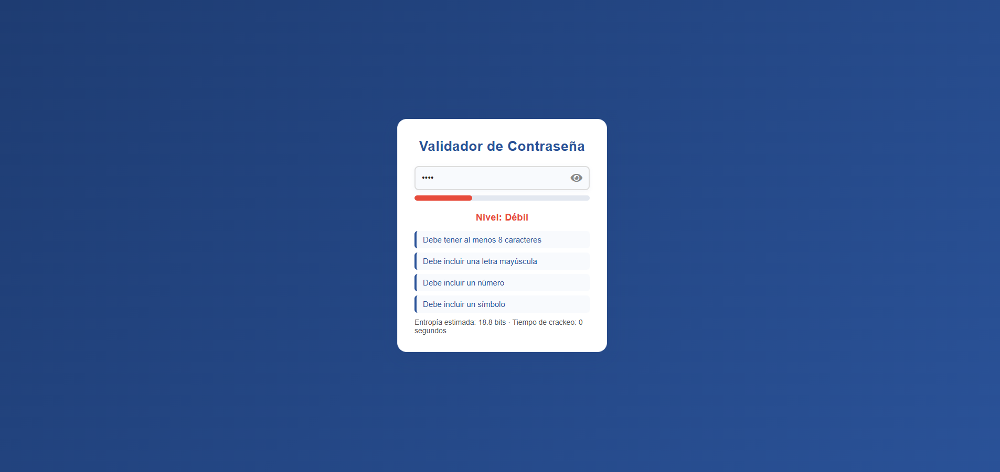

# Validador de Contraseñas

Micro-módulo web para evaluar la seguridad de contraseñas en tiempo real. Desarrollado para el Proyecto 2 de Sistemas de Calidad.

---

## 🚀 Objetivo
Permitir al usuario conocer la fortaleza de su contraseña y recibir recomendaciones inmediatas, aplicando buenas prácticas de calidad y usabilidad.

---

## 🛠️ Tecnologías
- HTML5
- CSS3 (diseño moderno y responsivo)
- JavaScript (lógica y feedback en tiempo real)

---

## ✨ Características
- Validación de longitud mínima (8 caracteres)
- Verificación de mayúsculas, números y símbolos
- Indicador visual de nivel: **Débil**, **Media**, **Fuerte**
- Barra de fortaleza animada y colorida
- Mostrar/ocultar contraseña con ícono
- Feedback personalizado y positivo
- Cálculo de entropía y tiempo estimado de crackeo
- Interfaz clara y amigable

---

## 🖥️ Instrucciones de uso
1. Abre el archivo `index.html` en tu navegador.
2. Escribe una contraseña en el campo.
3. Observa el nivel, la barra de fortaleza, el feedback y la entropía.
4. Usa el ícono de ojo para mostrar/ocultar la contraseña.

---

## 📊 Ejemplo visual



---

## 🔎 Interfaz pública JS
Puedes usar el validador desde la consola:

```js
window.PasswordValidator.eval('Password123!')
// → { nivel: 'Fuerte', feedback: [] }
```

---

## 🧪 Calidad y pruebas
- El código cumple con el objetivo de 100–300 LOC.
- Entradas y salidas claras.
- Retroalimentación inmediata y comprensible.
- Fácil de probar y mantener.

---

## 📥 Entrada esperada
El usuario ingresa una contraseña en el campo de texto.

**Ejemplo:**

```
Password123!
```

---

## 📤 Salida esperada
- Nivel de seguridad (Débil, Media, Fuerte)
- Feedback textual y visual
- Entropía y tiempo estimado de crackeo

---

## 👨‍💻 Autor
Desarrollado por [Paulo Pícado Calderón](https://github.com/PauloCR15) para Sistemas de Calidad.